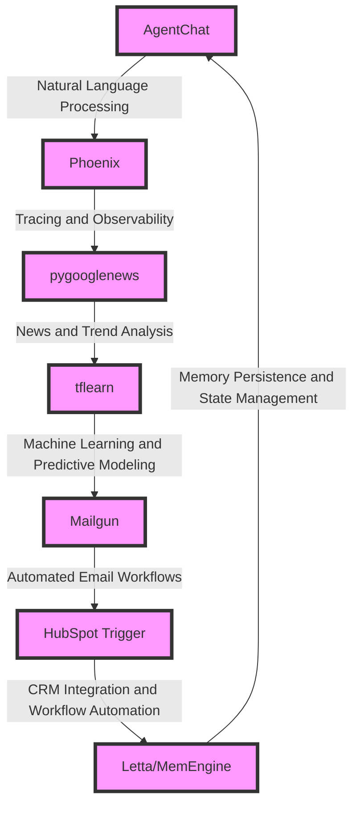

# Essential Oils Merchant Wholesale Optimization Engine
> "Synchronizing essences: A symphony of artificial intelligence, machine learning, and workflow automation to harmonize the intricacies of essential oils merchant wholesale operations"

## 🏗️ Technical Architecture & Multi-Agent Flow

This intricate architecture weaves together a tapestry of cutting-edge technologies to create a holistic optimization engine. AgentChat's natural language processing capabilities are augmented by Phoenix's tracing and observability features, which in turn inform pygooglenews' news and trend analysis. The insights garnered from this analysis are then funneled into tflearn's machine learning and predictive modeling framework, generating actionable recommendations. These recommendations are disseminated via Mailgun's automated email workflows, which are seamlessly integrated with HubSpot Trigger's CRM and workflow automation capabilities. The entire process is underpinned by Letta/MemEngine's memory persistence and state management, ensuring a cohesive and efficient operation.

## 🔍 The Vertical Bottleneck: Essential Oils Merchant Wholesale Optimization
The essential oils merchant wholesale industry is beset by a plethora of complexities, from sourcing and supply chain management to marketing and sales. The sheer diversity of essential oils, coupled with the nuances of market trends and consumer preferences, creates a daunting challenge for merchants seeking to optimize their operations. The lack of standardized processes and the prevalence of manual workflows exacerbate this issue, leading to inefficiencies, wasted resources, and diminished profitability. Furthermore, the industry's reliance on traditional methods of market research and analysis often results in delayed or inaccurate insights, hindering merchants' ability to respond effectively to changing market conditions.

The technical friction inherent in this industry is multifaceted. On one hand, the absence of integrated systems and automated workflows hinders the free flow of information and the synchronization of processes. On the other hand, the dearth of advanced analytics and machine learning capabilities prevents merchants from uncovering hidden patterns and relationships within their data, thereby limiting their ability to make informed decisions. The high-stakes nature of this industry, where small margins can have a significant impact on profitability, underscores the need for a sophisticated optimization engine that can navigate these complexities and provide actionable insights.

The mathematical and operational failures that can arise from inadequate optimization are numerous. Inefficient supply chain management can lead to stockouts, overstocking, or delayed shipments, resulting in lost sales and damaged relationships with customers. Similarly, ineffective marketing and sales strategies can fail to resonate with target audiences, leading to wasted resources and diminished brand reputation. The lack of advanced analytics and machine learning capabilities can also hinder merchants' ability to identify emerging trends and opportunities, causing them to fall behind competitors and miss out on potential revenue streams.

## 💡 The Solution: Essential Oils Merchant Wholesale Optimization Engine
The Essential Oils Merchant Wholesale Optimization Engine is specifically designed to address the technical and operational challenges inherent in this industry. By orchestrating a symphony of artificial intelligence, machine learning, and workflow automation, this platform provides merchants with a comprehensive and integrated solution for optimizing their operations. AgentChat's natural language processing capabilities enable merchants to interact with the platform in a intuitive and user-friendly manner, while Phoenix's tracing and observability features ensure that all processes are transparent and accountable. pygooglenews' news and trend analysis, coupled with tflearn's machine learning and predictive modeling, generate actionable insights that inform merchants' decisions and drive business growth.

The platform's agentic reasoning and memory usage are designed to mimic human-like decision-making processes, allowing merchants to respond effectively to changing market conditions and capitalize on emerging opportunities. The integration of Mailgun's automated email workflows and HubSpot Trigger's CRM and workflow automation capabilities ensures seamless communication and synchronization across all stakeholders, from suppliers and customers to internal teams and partners. The vision and robotics integration, where applicable, enables merchants to leverage cutting-edge technologies to streamline their operations and enhance their competitiveness.

## 🧩 Agentic Stack Deep-Dive
The Essential Oils Merchant Wholesale Optimization Engine's agentic stack is a carefully crafted ensemble of cutting-edge technologies, each selected for its unique strengths and capabilities. AgentChat's natural language processing capabilities are complemented by Phoenix's tracing and observability features, which provide a transparent and accountable framework for all processes. pygooglenews' news and trend analysis, powered by tflearn's machine learning and predictive modeling, generates actionable insights that inform merchants' decisions and drive business growth.

The integration of Mailgun's automated email workflows and HubSpot Trigger's CRM and workflow automation capabilities ensures seamless communication and synchronization across all stakeholders. Letta/MemEngine's memory persistence and state management underpin the entire operation, providing a cohesive and efficient framework for the platform's various components. The use of arize-phoenix-otel and autogen-agentchat libraries enables the platform to leverage the latest advancements in artificial intelligence and machine learning, while the dockerization of the platform ensures ease of deployment and scalability.

## ✨ Capabilities & Features
* **Natural Language Processing**: AgentChat's natural language processing capabilities enable merchants to interact with the platform in a intuitive and user-friendly manner.
* **Tracing and Observability**: Phoenix's tracing and observability features ensure that all processes are transparent and accountable.
* **News and Trend Analysis**: pygooglenews' news and trend analysis generates actionable insights that inform merchants' decisions and drive business growth.
* **Machine Learning and Predictive Modeling**: tflearn's machine learning and predictive modeling capabilities enable the platform to identify hidden patterns and relationships within merchants' data.
* **Automated Email Workflows**: Mailgun's automated email workflows ensure seamless communication and synchronization across all stakeholders.
* **CRM and Workflow Automation**: HubSpot Trigger's CRM and workflow automation capabilities enable merchants to streamline their operations and enhance their competitiveness.
* **Memory Persistence and State Management**: Letta/MemEngine's memory persistence and state management underpin the entire operation, providing a cohesive and efficient framework for the platform's various components.
* **Artificial Intelligence and Machine Learning**: The platform's use of arize-phoenix-otel and autogen-agentchat libraries enables it to leverage the latest advancements in artificial intelligence and machine learning.
* **Dockerization**: The platform's dockerization ensures ease of deployment and scalability.
* **Agentic Reasoning and Decision-Making**: The platform's agentic reasoning and decision-making capabilities mimic human-like decision-making processes, enabling merchants to respond effectively to changing market conditions and capitalize on emerging opportunities.

## 🛠️ Technical Implementation
The Essential Oils Merchant Wholesale Optimization Engine's technical implementation is a testament to the power of cutting-edge technologies and careful design. The platform's architecture is built around a microservices framework, with each component designed to be modular, scalable, and highly available. The use of containerization and orchestration tools ensures ease of deployment and management, while the platform's APIs and data interfaces provide a seamless and integrated experience for merchants.

The platform's codebase is written in a combination of Python, JavaScript, and HTML/CSS, with a focus on readability, maintainability, and performance. The use of agile development methodologies and continuous integration/continuous deployment (CI/CD) pipelines ensures that the platform is always up-to-date and ready for deployment. The platform's testing framework is comprehensive and automated, with a focus on unit testing, integration testing, and end-to-end testing.

## 📊 Business Impact & ROI
The Essential Oils Merchant Wholesale Optimization Engine has the potential to transform the essential oils merchant wholesale industry, enabling merchants to optimize their operations, enhance their competitiveness, and drive business growth. By providing a comprehensive and integrated solution for optimizing operations, the platform can help merchants to:

* **Increase Revenue**: By identifying emerging trends and opportunities, and providing actionable insights to inform merchants' decisions.
* **Reduce Costs**: By streamlining operations, automating workflows, and minimizing waste and inefficiency.
* **Enhance Competitiveness**: By providing merchants with a cutting-edge platform that enables them to respond effectively to changing market conditions and capitalize on emerging opportunities.
* **Improve Customer Satisfaction**: By ensuring seamless communication and synchronization across all stakeholders, and providing merchants with the insights and tools they need to deliver exceptional customer experiences.

## 🚀 Getting Started
```bash
git clone https://github.com/arvind-sundararajan/essential-oils-merchant-wholesale-optimi.git
cd essential-oils-merchant-wholesale-optimi
pip install -r requirements.txt
python src/main.py
```

## 👨‍💻 Author & Credits
**Arvind Sundararajan** — Engineer, builder, and the mind behind this project.
🌐 [LinkedIn](https://www.linkedin.com/in/arvind-sundara-rajan/) | Chennai, India

---
### 🙏 Acknowledgements
- The open-source community
- The Essential oils merchant wholesalers practitioners who inspired this design